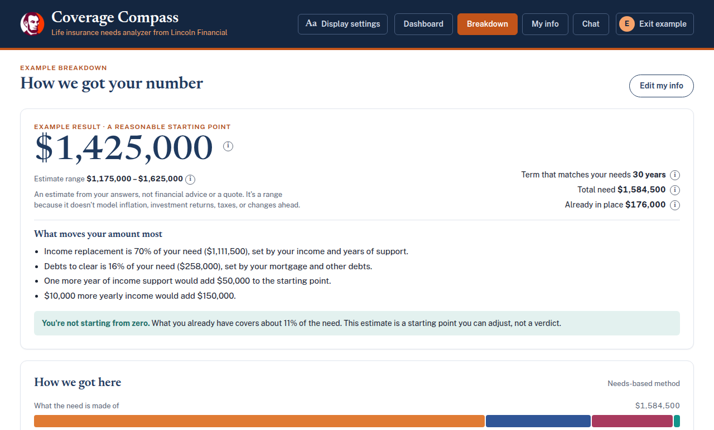
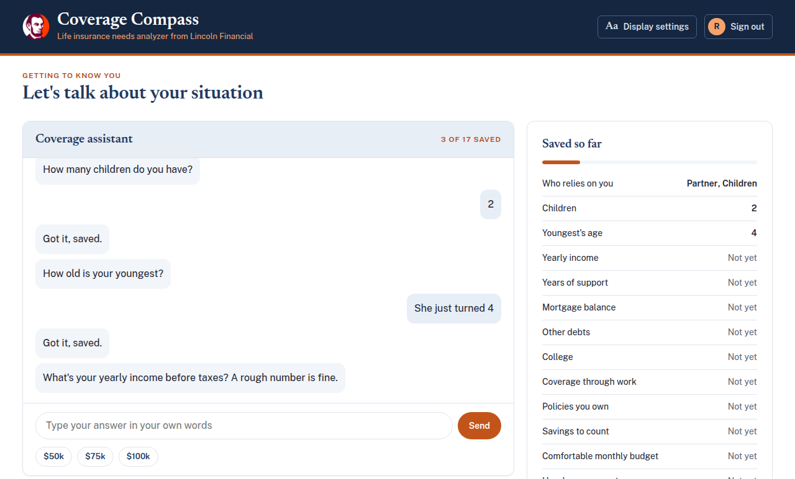
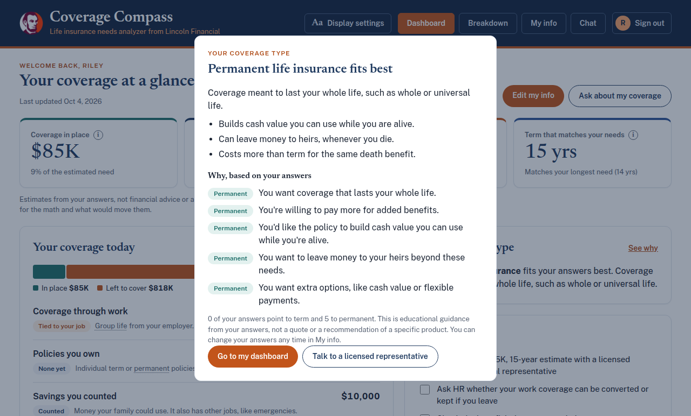
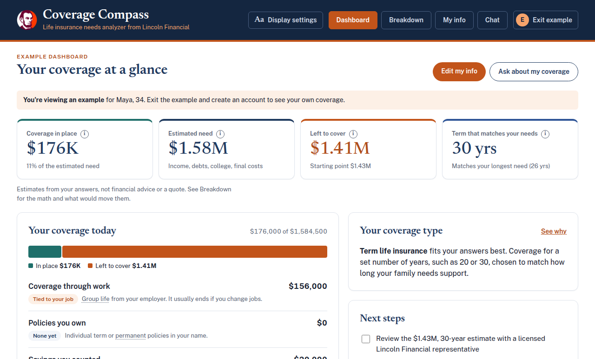
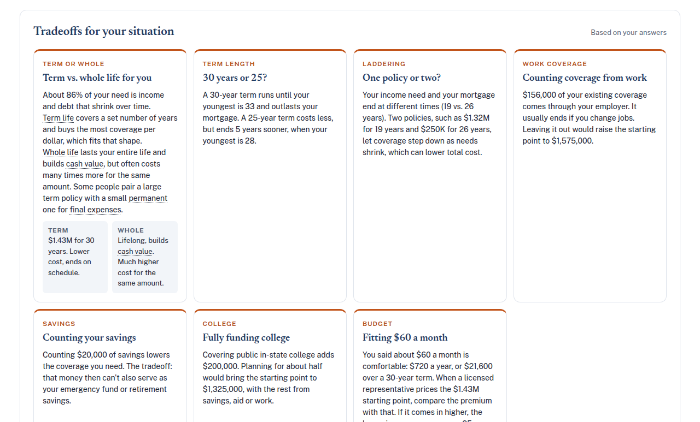
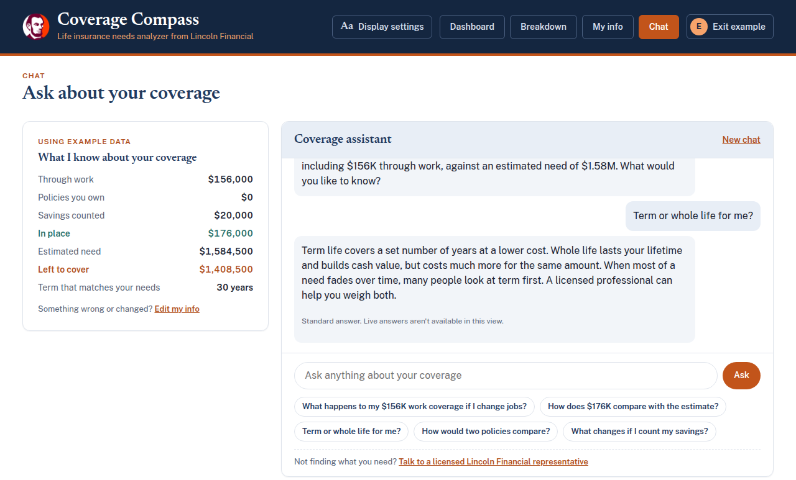
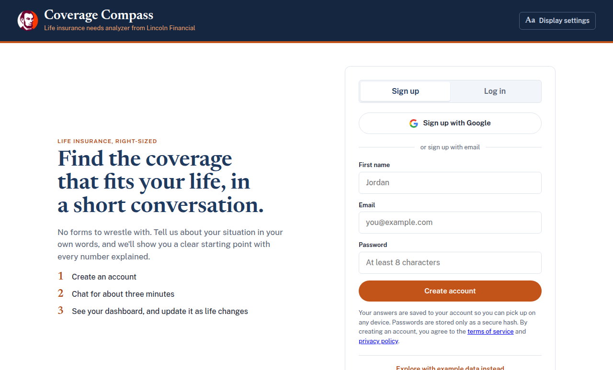
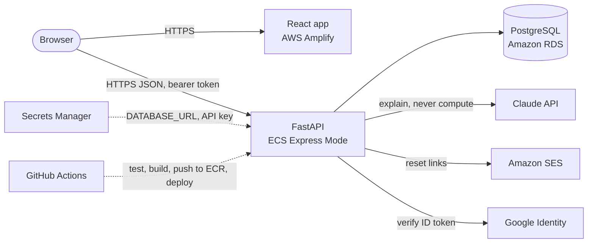

# Coverage Compass

**A conversational life insurance needs analyzer.** Answer a few questions in plain language and
Coverage Compass shows how much life cover might fit your family, every line of the arithmetic
behind it, the trade-offs that follow from your own answers, and whether term or permanent
coverage suits your preferences.

Built by team **Spartans** for the **codeLinc 11** coding challenge (Path 2: Life Insurance Needs
Analyzer), October 2026.

[](https://github.com/darylcarter2006/CodeLinc11/actions/workflows/backend-ci.yml)
[](https://github.com/darylcarter2006/CodeLinc11/actions/workflows/frontend-ci.yml)
[](https://github.com/darylcarter2006/CodeLinc11/actions/workflows/backend-deploy.yml)

**Live demo:** <https://main.d2g8j1b83mvwk9.amplifyapp.com>. Create an account, or click
**"Explore with example data instead"** to look around without signing up.



---

## Contents

- [What it does](#what-it-does)
- [Screenshots](#screenshots)
- [Engineering highlights](#engineering-highlights)
- [Architecture](#architecture)
- [How the estimate works](#how-the-estimate-works)
- [Tech stack](#tech-stack)
- [Run it yourself](#run-it-yourself)
- [Testing and quality](#testing-and-quality)
- [Security and privacy](#security-and-privacy)
- [Project structure](#project-structure)
- [Team](#team)

## What it does

- **A real conversation, not a form.** Onboarding asks one question at a time and adapts to what
  you say: no children means no questions about children's ages or college; no one depending on
  your income means no years-of-support question; renting means no mortgage-term question.
  Answer in your own words ("she just turned 4", "about 85k", "2x salary") and it understands.
- **A cover amount you can check.** The Breakdown tab shows the starting point, a range, and
  every line of the arithmetic, plus which of your answers move the amount most and by how much
  ("one more year of income support would add $50,000").
- **Change an answer, see the effect.** Edit anything in My info and the estimate recalculates
  at once, telling you exactly how far the starting point moved.
- **Trade-offs about your situation, not generic pros and cons.** Cards are chosen and written
  from your answers: whether a shorter term would still cover your youngest, whether two
  "laddered" policies fit a mortgage that ends at a different time than income support, what
  happens if you leave the job that provides group cover, and how your stated monthly budget
  compares.
- **Term or permanent, explained in your terms.** Five quick preference questions are tallied
  quietly; a result pop-up explains which type fits and why, citing each of your answers.
- **An assistant that explains, never invents.** A chat tab answers questions about your own
  coverage. The math is always done by the app's code; the AI only explains it, and every dollar
  figure it writes is checked against the computed numbers before you see it.
- **A person when you want one.** "Talk to a licensed representative" sends a callback request,
  optionally with a summary of your estimate.
- **Accessible.** Larger text, high contrast and an easier-to-read font from any page; full
  keyboard support, focus management in dialogs, and screen-reader labels throughout.
- **Honest.** Every amount sits next to "an estimate, not financial advice or a quote", and the
  copy stays calm: "starting point", never "shortfall".

## Screenshots

| Onboarding conversation | Coverage-type result |
|---|---|
|  |  |
| **Dashboard** | **Trade-offs from your own answers** |
|  |  |
| **Chat** | **Sign up or log in** |
|  |  |

## Engineering highlights

**Deterministic math, verified AI.** The cover amount comes from a pure, tested function
([`needs.ts`](frontend/src/domain/needs.ts)), mirrored on the server
([`compass.py`](backend/app/domain/compass.py)) so the server never trusts the browser's numbers.
The language model only reads free-text answers into fields (validated like any other input) and
explains results. Before a chat answer is shown, [`figures.py`](backend/app/domain/figures.py)
extracts every dollar amount ("$1.43M", "$58.5k", "$1,425,000"), and each must match an amount the
calculation produced for this person, at the precision written and within 5%. Otherwise the
answer is withheld and a standard answer is shown with a note saying why.

**Graceful degradation.** If the model is unavailable, slow or fails, onboarding falls back to a
built-in parser and Chat to standard answers, clearly labelled. AI calls have time limits on both
the server and the browser, saves retry automatically with a visible banner, and nothing a person
has entered is ever lost.

**Real accounts, done properly.**
- Email and password sign-up with **Argon2id** hashing (OWASP parameters), NIST-style password
  rules, and the same answer, taking the same time, for a wrong email or a wrong password.
- **Google sign-in**, with the token's signature verified on the server.
- **Password reset by email** through Amazon SES: single-use links that expire after 30 minutes,
  stored only as hashes, with the token in the URL fragment so it never reaches a server log.
- Protection against **account pre-hijacking**: if someone registers your email with a password
  and you later sign in with Google, the unverified password is removed and their sessions end.

**Production on AWS.**
- The API runs on **ECS Express Mode** behind an HTTPS load balancer.
- Data lives in **RDS PostgreSQL** with TLS verified against the RDS CA, encryption at rest, and
  Alembic migrations.
- Secrets are injected from **Secrets Manager**; the app holds no keys in code or images.
- The front end is hosted on **Amplify** with a strict Content-Security-Policy.
- **GitHub Actions** runs the tests on every pull request and deploys every merge to `main`:
  build, push to ECR, roll out and health-check. It refuses to deploy a merge that adds a
  database migration until a person has applied it.

**Runs anywhere in one command.** The root [Dockerfile](Dockerfile) builds the React app and
serves it from the FastAPI backend: one container that needs no network, credentials or database
(accounts in memory, the built-in parser instead of the model).

## Architecture



- **Front end:** a React single-page app. All amounts are computed in the browser for instant
  feedback, and again on the server for anything the server says or stores.
- **Backend:** FastAPI with a small service layer and repository interfaces. Each store (accounts,
  saved answers, callback requests) has an in-memory version for tests and local use and a
  PostgreSQL version for production, chosen by one setting.
- **Middleware:** a pure-ASGI layer adds request IDs, a 16 KB body limit, a consistent JSON error
  envelope, redacted access logs, and security headers on every response.

## How the estimate works

A standard needs-based method, with every assumption stated in the app:

| Part | Formula |
|---|---|
| Income replacement | 75% of yearly income × years of support (at least until the youngest child turns 18) |
| Debts to clear | Mortgage balance + other debts |
| College | $100,000 per child (public in-state) or $50,000 (about half) |
| Final expenses | $15,000 |
| **Left to cover** | Total need − (coverage through work + policies owned + savings counted) |
| **Starting point** | Left to cover, rounded up to the nearest $25,000, with a ±15% range |
| **Matching term** | The longest need (years of support or mortgage years), rounded up to a standard term |

The six inputs the brief asks for, each its own question and its own field:

| Input | Fields | Read by |
|---|---|---|
| People who depend on the income | `deps`, `children`, `youngest` | years of support, college |
| Income to replace | `income`, `years` | income replacement |
| Mortgage and other debts | `mortgage`, `mortgageYears`, `otherDebt` | debts, matching term |
| Education and future expenses | `college` | college |
| Cover already held | `group`, `policies`, `savings` | coverage in place |
| What they can afford | `monthlyBudget`, `budget` | budget figures and trade-off, term vs. permanent |

Two families, two conversations ([tested](frontend/src/domain/profile.test.ts)):

- *Partner and two kids, with a mortgage:* who depends on you → how many children → youngest's
  age → income → years of support → mortgage → years left on it → other debts → college → work
  coverage → own policies → savings → monthly budget → five coverage-type questions.
- *No dependants, renting:* who depends on you → income → mortgage → other debts → work coverage
  → own policies → savings → monthly budget → five coverage-type questions.

## Tech stack

| Area | Technology |
|---|---|
| Front end | React 19, TypeScript 6, Vite 8, React Router 7, hand-written CSS with design tokens |
| Backend | Python 3.12, FastAPI, Pydantic v2, SQLAlchemy 2 (async) with asyncpg, Alembic |
| AI | Anthropic Claude API (official Python SDK), behind an adapter with a no-model fallback |
| Auth | Argon2id (argon2-cffi), Google Identity Services with server-side ID-token verification |
| Data | PostgreSQL 18 on Amazon RDS |
| Cloud | AWS ECS Express Mode, ECR, RDS, Secrets Manager, SES, Amplify, CloudWatch, IAM |
| CI/CD | GitHub Actions: tests on every pull request; build, push and deploy on merge |
| Quality | pytest (98% coverage), Vitest and Testing Library, mypy (strict), Ruff, oxlint, pip-audit, npm audit |

## Run it yourself

**One container** (requires Docker):

```bash
git clone https://github.com/darylcarter2006/CodeLinc11.git
cd CodeLinc11
docker build -t coverage-compass .
docker run --rm -p 8000:8000 coverage-compass
```

Open <http://localhost:8000>. In this mode accounts and saved answers are kept in memory,
onboarding uses the built-in parser, Chat gives standard answers, and password reset emails are
printed to the container's log.

**For development** (Node.js 22+ and Python 3.12+, in two terminals):

```bash
cd backend
python3 -m venv .venv && .venv/bin/pip install -e ".[dev]"
.venv/bin/uvicorn app.main:app --reload            # API on http://localhost:8000
```

```bash
cd frontend
npm install
npm run dev                                         # app on http://localhost:5173
```

The front end proxies API calls to the backend. Everything works without credentials. To switch
on live AI answers, add `AI_PROVIDER=anthropic` and `ANTHROPIC_API_KEY=...` to `backend/.env`,
which is gitignored. Every setting is documented in
[backend/.env.example](backend/.env.example). Deployment guides are in
[backend/docs/](backend/docs/).

## Testing and quality

```bash
cd backend && .venv/bin/pytest      # 339 tests
cd frontend && npm test             # 169 tests
```

- **Calculation:** golden test vectors, rounding and term edges, the age-18 extension, the
  already-covered case, budget and "what moves it most" arithmetic.
- **Conversation:** different families produce different question sequences; the local parser;
  a full sign-up → onboarding → dashboard → edit flow in a simulated browser.
- **AI safety:** invented dollar figures are caught, prompt-injection attempts stay quoted as
  data, unusable model output falls back cleanly, and a dropped answer is an error, never half an
  answer.
- **Accounts and data:** sign-up, log-in limits, password change and reset, Google linking,
  account deletion, scheduled expiry, and crash logs that contain no personal values.
- **Real database:** CI runs the API suite against PostgreSQL as well as in memory.
- **Coverage and static checks:** CI requires at least 90% backend line coverage (currently
  98%), and runs strict mypy, Ruff, oxlint and the TypeScript build. Dependencies are audited
  with pip-audit and npm audit (no known vulnerabilities).

## Security and privacy

- **Input and abuse:** every request body is validated with strict schemas. Requests are rate
  limited per IP and per email (for log-in and reset), and the AI has a global cap so costs stay
  bounded.
- **Browser protection:** security headers everywhere: a CSP with no inline scripts, HSTS,
  `nosniff`, and frame denial. CORS is limited to an explicit allow-list.
- **Data minimization:** the app collects only what the estimate needs. It rejects anything that
  looks like a Social Security or account number, and stopped asking for age once nothing used
  it.
- **Retention and deletion:** people can delete their account and everything kept for it at any
  time. Unused accounts are deleted after 180 days and callback requests after 30.
- **Logging:** logs record only allow-listed fields, never answers, emails or contact details.
- **Written policy:** what is kept, where and for how long is documented in
  [docs/data-handling.md](docs/data-handling.md) and in the app's
  [privacy policy](https://main.d2g8j1b83mvwk9.amplifyapp.com/privacy).

## Project structure

```text
.
├── Dockerfile                  # the whole app in one container
├── backend/                    # FastAPI service
│   ├── app/
│   │   ├── api/                # routes: auth, account, ai, support, health
│   │   ├── domain/             # needs calculation, figure checks, coverage-type tally
│   │   ├── services/           # accounts, AI orchestration, personal data, support
│   │   ├── repositories/       # in-memory and PostgreSQL stores
│   │   ├── ai/                 # Claude adapter and the no-model stub
│   │   ├── middleware/         # request context, security headers, error envelope
│   │   └── db/migrations/      # Alembic migrations
│   ├── tests/                  # unit and API tests
│   └── docs/                   # deployment, database and Google sign-in guides
├── frontend/                   # React + TypeScript app
│   └── src/
│       ├── domain/             # needs calculation, parser, explanations, trade-offs
│       ├── pages/              # onboarding, dashboard, breakdown, My info, chat, auth
│       ├── components/         # dialogs, charts, tooltips, accessibility menu
│       ├── services/           # API client, auth, saved-answer store
│       └── state/              # app-wide state and saving
├── docs/                       # data handling, product spec, design tokens, screenshots
└── .github/workflows/          # CI and deployment
```

## Team

Built together by team **Spartans** for codeLinc 11:

- [@darylcarter2006](https://github.com/darylcarter2006)
- [@hmpears2](https://github.com/hmpears2) / [@pearshm2](https://github.com/pearshm2)
- [@SMmaanaki-stack](https://github.com/SMmaanaki-stack)

---

*Coverage Compass is an educational concept built for the codeLinc 11 coding challenge.
Estimates use simple, stated assumptions and are not financial advice or a quote. The Lincoln
Financial name and logo are used with permission for the challenge.*
